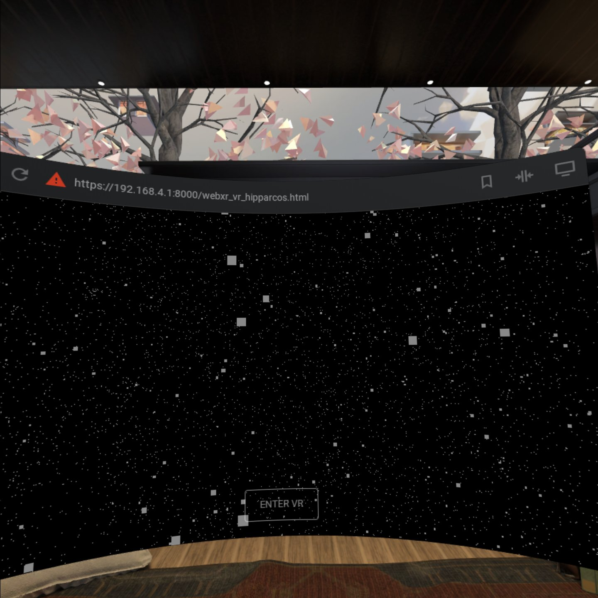
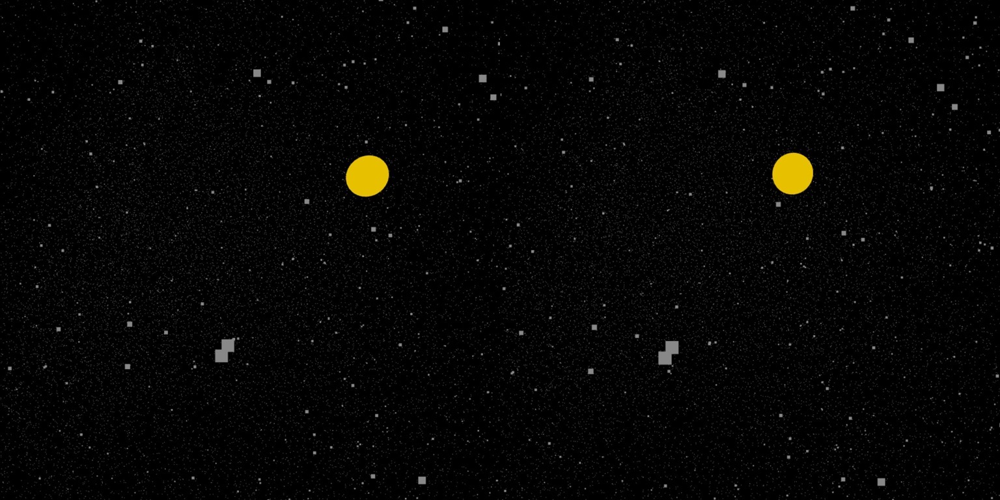

# Threejs-VR-Hipparcos

Explore Hipparcos Catalogue of 119,617 stars with Threejs VR.

Stereoscopic view.

# Hardware

Oculus Quest recommended (required 6DOF headset/controllers). 

# Software

Oculus Browser (Oculus Quest Firmware update 12.0 or later).

# Threejs-VR-Hipparcos Pages

[https://physicslibrary.github.io/Threejs-VR-Hipparcos/](https://physicslibrary.github.io/Threejs-VR-Hipparcos/)

# Installation

No installation. In Oculus Quest, open Oculus Browser and go to link:

[https://physicslibrary.github.io/Threejs-VR-Hipparcos/examples/webxr_vr_hipparcos.html](https://physicslibrary.github.io/Threejs-VR-Hipparcos/examples/webxr_vr_hipparcos.html)

Solar system is the yellow sphere.

Oculus Quest's headset 6DOF tracking works but no controllers (keep code simple, no common star names yet, no warp drive yet).

Here is a scaled down (distance between stars) slice view of Hipparcos Catalog:

[https://physicslibrary.github.io/Threejs-VR-Hipparcos/examples/webxr_vr_hipparcos2.html](https://physicslibrary.github.io/Threejs-VR-Hipparcos/examples/webxr_vr_hipparcos2.html)

# Credits

[https://threejs.org/](https://threejs.org/)

hygxyz.csv (1989 data): 
[https://github.com/astronexus/HYG-Database](https://github.com/astronexus/HYG-Database)

# References

[https://www.cosmos.esa.int/web/hipparcos/home](https://www.cosmos.esa.int/web/hipparcos/home)

[https://www.cosmos.esa.int/web/hipparcos/common-star-names](https://www.cosmos.esa.int/web/hipparcos/common-star-names)

[http://sci.esa.int/star_mapper/](http://sci.esa.int/star_mapper/)

[https://en.wikipedia.org/wiki/Hipparcos](https://en.wikipedia.org/wiki/Hipparcos)

This project is a port of [https://github.com/Physicslibrary/ARKit-Stereoscope-Hipparcos](https://github.com/Physicslibrary/ARKit-Stereoscope-Hipparcos) which started with a book "3D Scientific Visualization with Blender". In the book, there is a tutorial on how to plot a stellar catalog.

Brian R. Kent, 3D Scientific Visualization with Blender, Morgan & Claypool Publishers (2015).

[https://www.cv.nrao.edu/~bkent/blender/thebook.html](https://www.cv.nrao.edu/~bkent/blender/thebook.html)

[https://www.cv.nrao.edu/~bkent/blender/tutorials.html](https://www.cv.nrao.edu/~bkent/blender/tutorials.html)

Three.js on how to convert WebGL examples to WebVR:

[https://threejs.org/docs/index.html#manual/en/introduction/How-to-create-VR-content](https://threejs.org/docs/index.html#manual/en/introduction/How-to-create-VR-content)

Three.js on how to load a file (eg. read hygxyz.csv):

[https://threejs.org/docs/index.html#api/en/loaders/FileLoader](https://threejs.org/docs/index.html#api/en/loaders/FileLoader)

Three.js on how to draw a star field:

[https://threejs.org/docs/#api/en/materials/PointsMaterial](https://threejs.org/docs/#api/en/materials/PointsMaterial)

Three.js examples is the best place to learn and experiment:

[https://github.com/mrdoob/three.js/tree/dev/examples](https://github.com/mrdoob/three.js/tree/dev/examples)

[https://github.com/Physicslibrary/Threejs-WebXR-67P](https://github.com/Physicslibrary/Threejs-WebXR-67P)

[https://stars.chromeexperiments.com/](https://stars.chromeexperiments.com/)

[https://www.html5rocks.com/en/tutorials/casestudies/100000stars/](https://www.html5rocks.com/en/tutorials/casestudies/100000stars/)

http://exploratoria.github.io/exhibits/astronomy/star-spotter/index.html

# Making Threejs-VR-Hipparcos (under construction)

Camera frustum far plane default is 2000. Check how many stars are within this boundary. 

[https://threejs.org/docs/#api/en/cameras/PerspectiveCamera](https://threejs.org/docs/#api/en/cameras/PerspectiveCamera)

  Copyright (c) 2020 Hartwell Fong
